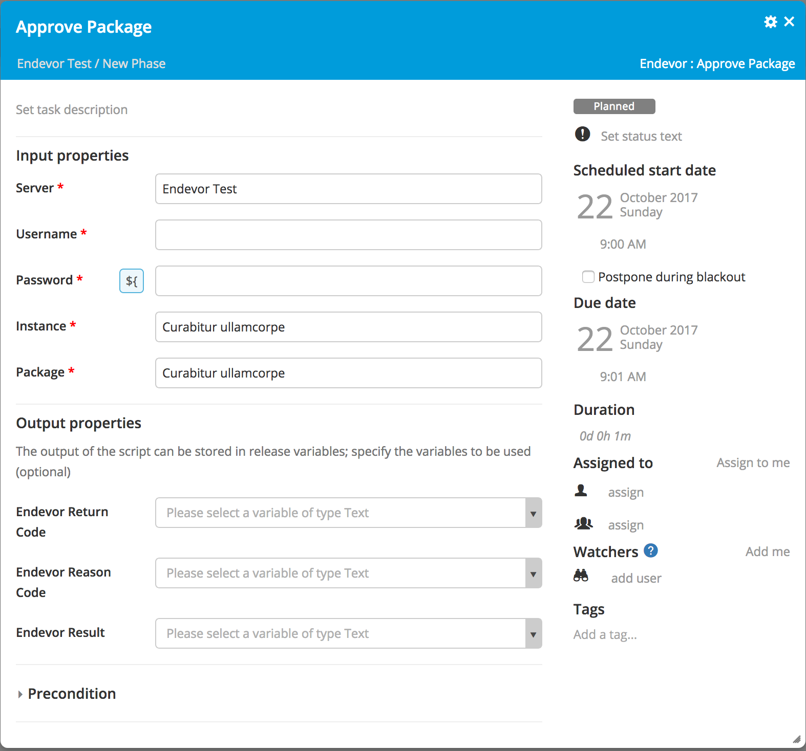
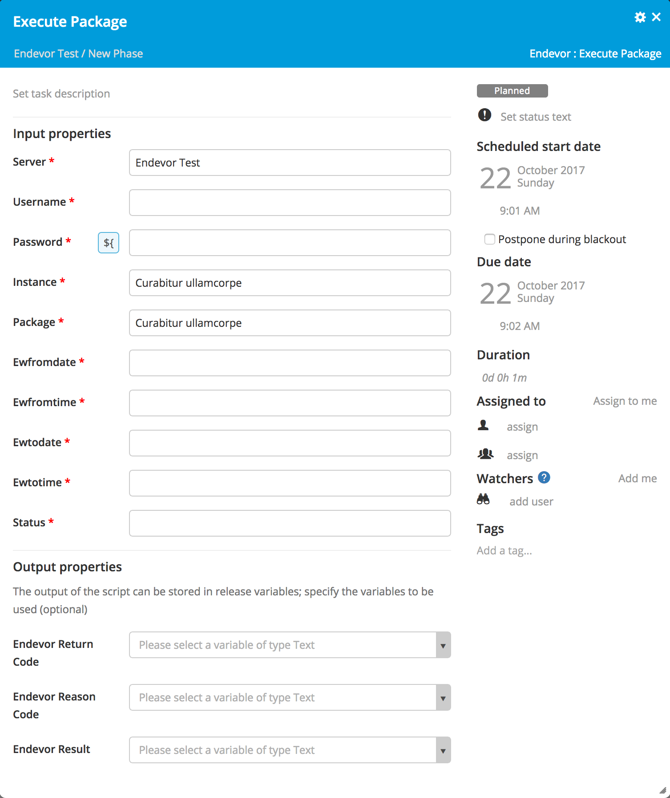
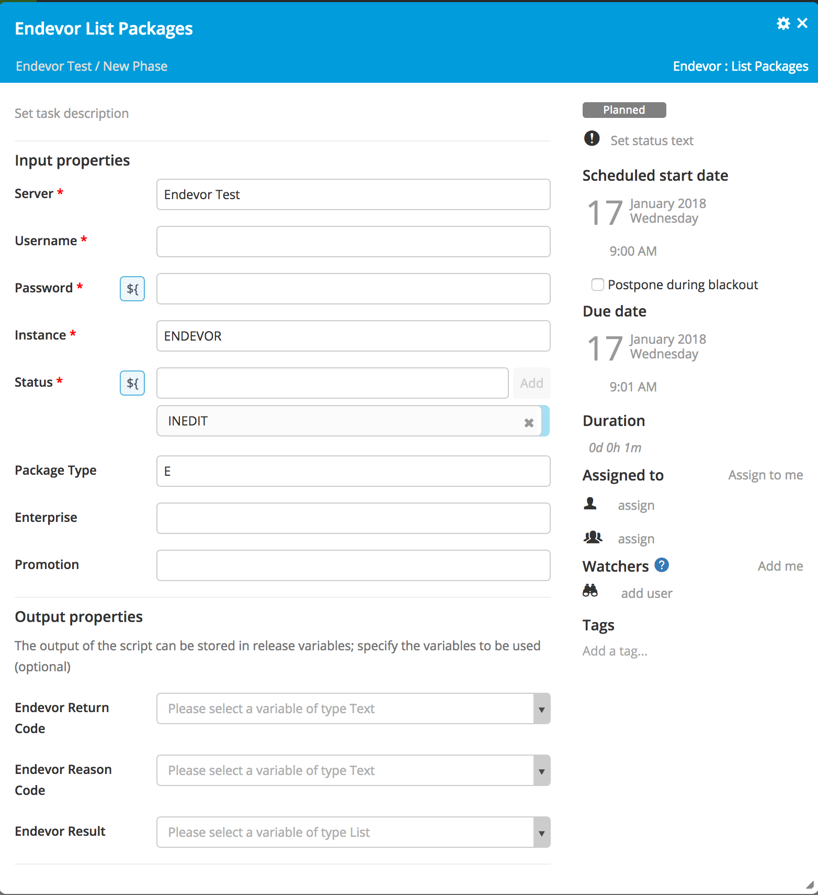
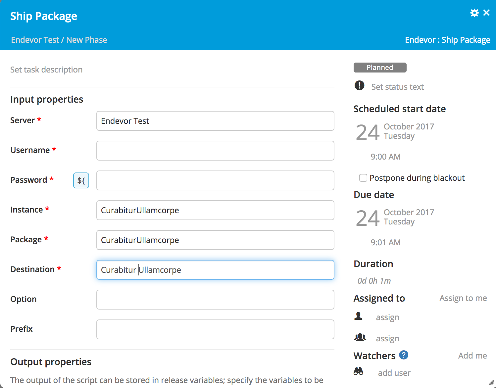

# XL Release Endevor plugin v0.1.0

[![Build Status][xlr-endevor-plugin-travis-image]][xlr-endevor-plugin-travis-url]
[![License: MIT][xlr-endevor-plugin-license-image]][xlr-endevor-plugin-license-url]
![Github All Releases][xlr-endevor-plugin-downloads-image]

[xlr-endevor-plugin-travis-image]: https://travis-ci.org/xebialabs-community/xlr-endevor-plugin.svg?branch=master
[xlr-endevor-plugin-travis-url]: https://travis-ci.org/xebialabs-community/xlr-endevor-plugin
[xlr-endevor-plugin-license-image]: https://img.shields.io/badge/License-MIT-yellow.svg
[xlr-endevor-plugin-license-url]: https://opensource.org/licenses/MIT
[xlr-endevor-plugin-downloads-image]: https://img.shields.io/github/downloads/xebialabs-community/xlr-endevor-plugin/total.svg

## Preface

This document describes the functionality provided by the xlr-endevor-plugin.

See the **[XL Release Documentation](https://docs.xebialabs.com/xl-release/index.html)** for background information on XL Release and release concepts.

## Overview

This is a plugin allows XL Release to interact with Endevor for deploying, promoting and managing applications on the mainframe.

## Installation

* Copy the xlr-endevor-plugin by copying the plugin jar to the **XL-RELEASE-HOME/plugin** folder.
* On the Mainframe install the following:
	* 	SMID Web Services 
	*  CISQ103
	*  Tomcat under Unix services
	*  Communications EAX
	*  RESTful client or SOAP
*  Restart XL Release

## Functionality

**Assumes the CA Endevor SCM Web Services component is installed.**

### Approve Package

**Code returns dummy values for now pending testing against a live installation of CA Endevor.**

This action approves a package.

##### Input: 

| Variable | Description  |
|----------|--------------|
| instance | Name of a specific Endevor instance to validate instead of all available Endevor instances. |
| Package  | The package  |

##### Output: 

### Backin Package

**Code returns dummy values for now pending testing against a live installation of CA Endevor.**

This action backs in a package.

##### Input: 

##### Output: 

### Backout Package

**Code returns dummy values for now pending testing against a live installation of CA Endevor.**

This action backs out a package.

##### Input: 

##### Output: 

### Cast Package

**Code returns dummy values for now pending testing against a live installation of CA Endevor.**

This action casts a package.

##### Input:

##### Output:

### Commit Package

**Code returns dummy values for now pending testing against a live installation of CA Endevor.**

The COMMIT PACKAGE action removes all backout/backin data while retaining package event information. You can use the COMMIT action against a package only if the package has a status of **Executed** or **Exec-failed**.

##### Input:

##### Output:

### Delete Package

**Code returns dummy values for now pending testing against a live installation of CA Endevor.**

This action deletes a package.

##### Input: 

##### Output: 

### Execute Package

**Code returns dummy values for now pending testing against a live installation of CA Endevor.**

This action executes a package.

##### Input:

| Variable | Description  |
|----------|--------------|
| instance | Name of a specific Endevor instance to validate instead of all available Endevor instances. |
| Package  | The package  |
| Ewfromdate | Specifies the time frame within which to execute the package (Execution window). You can only use the execution window parameters if the package is fully qualified and the existing execution window is closed. |
| Ewfromtime | Specifies the time frame within which to execute the package (Execution window). You can only use the execution window parameters if the package is fully qualified and the existing execution window is closed. |
| Ewtodate | Specifies the time frame within which to execute the package (Execution window). You can only use the execution window parameters if the package is fully qualified and the existing execution window is closed. |
| Ewtotime | Specifies the time frame within which to execute the package (Execution window). You can only use the execution window parameters if the package is fully qualified and the existing execution window is closed.| 
| Status | Specifies the statuses of the package you want to execute. You can only use this clause when you wildcard the package ID. The default is to execute packages that have a status of Approved. ( Valid statuses are: **APPROVED**, **EXECFAILED** |

##### Output:

### List All Configurations

**Code returns dummy values for now pending testing against a live installation of CA Endevor.**

This action lists all the available CA Endevor SCM configurations on the server.

##### Input:
None

##### Output:
List of available CA Endevor SCM instances that are defined by configuration files on the server in JSON format.

### List Parameters of a Configuration

**Code returns dummy values for now pending testing against a live installation of CA Endevor.**

This action lists all the parameters of a specific CA Endevor SCM configuration.

#####Input: 
Configuration instance

##### Output: 
List of a specific CA Endevor SCM configuration in JSON format.

### List Packages

The List package action lists CA Endevor SCM packages. Name-masking is supported to filter package names.

##### Input:

| Variable | Description  |
|----------|--------------|
| instance | Name of a specific Endevor instance to validate instead of all available Endevor instances. |
| status   | filters by one or more of **INEDIT**, **INAPPROVAL**, **APPROVED**, **INEXECUTION**, **EXECUTED**, **COMMITTED**, **DENIED**.|
| type     | filters by Standard or Emergency |
| enterprise  | filters by enterprise package parameter, all, enterprise, exclude |
| promotion | filters by promotion package parameter, all, promotion or exclude |

##### Output:
List of Packages in JSON format, which corresponds to the CA Endevor SCM List Package ID function of the CSV utility. 

### Reset Package

**Code returns dummy values for now pending testing against a live installation of CA Endevor.**

This action resets a package.

##### Input: 

##### Output: 

### Ship Package

The SHIP PACKAGE action is used to ship a package to a remote site. You can ship the package output members or the package backout members. The Ship Package task will let you indicate the package that you wnat to ship, the destination to ship the package to and if you want to ship output or backout members as well as set the data set name prefix in the XCOM or CONNECT:DIRECT transmission methods.

##### Input:

| Variable | Description  |
|----------|--------------|
| instance | Name of a specific Endevor instance to validate instead of all available Endevor instances. |
| Package  | The package  |
| destination | Indicates the name of the remote site to which you want to ship the specified package. This parameter is mandatory. |
| option   | Indicates whether you want to ship output members, or backout members to the remote site. |
| prefix   | Indicates the data set name prefix to be used in the XCOM or CONNECT:DIRECT transmission methods.

##### Output:

### Create Package

**Code returns dummy values for now pending testing against a live installation of CA Endevor.**

This action creates a package.

##### Input: 

| Variable | Description  |
|----------|--------------|
| description | Allows you to associate a 50-character description with the package. |
| ewfromdate (DDMMMYY) |  Specify the time frame within which to execute the package. |
| ewfromtime (HH:mm) | Specify the time frame within which to execute the package. |
| ewtodate (DDMMMYY) | Specify the time frame within which to execute the package. |
| ewtotime (HH:mm) | Specify the time frame within which to execute the package. | 
| type | Specify the package type, where **S** = *STANDARD* and **E** = *EMERGENCY*. If you do not specify this option and you are creating a package, the package defaults to a *STANDARD* (**S**) package. |
| sharable | Specify whether this package can be edited by more than one person when in In-edit status. If you do not specify this option and you are creating a package, the package defaults to a *NONSHARABLE* (**no**) package. |
| backout | Indicates whether you want to have the backout facility available for this package. Use this clause when creating a package only. |
| append | Indicates whether to append the SCL you are adding to the existing package SCL or to replace it. |
| promotion | Define the package as a promotion package or a nonpromotion package. If you do not specify this option and you are creating a package, the package defaults to a NONPROMOTION (no) package. | 
| fromPackage= | Directs the Create/Update action to copy the SCL from the package you specify into the package you are creating or updating. Use a fully specified package ID.| 
| fromDSN= | Direct the Create/Update action to copy the SCL from the member (fromMember) in the data set name (fromDSN) you specify into the package you are creating or updating. Specify them together. |
| fromMember= | Direct the Create/Update action to copy the SCL from the member (fromMember) in the data set name (fromDSN) you specify into the package you are creating or updating. Specify them together. |
| validateSCL | Specify this option to not validate the package components while creating a package. |
| sclfile | Use this input to add remarks to the package definition. Each line in the input represents one note. You can specify up to 8 text lines of up to 60 characters each. |

##### Output:

### Update Package

**Code returns dummy values for now pending testing against a live installation of CA Endevor.**

This action updates a package.

##### Input: 

| Variable | Description  |
|----------|--------------|
| description | Allows you to associate a 50-character description with the package. |
| ewfromdate (DDMMMYY) |  Specify the time frame within which to execute the package. |
| ewfromtime (HH:mm) | Specify the time frame within which to execute the package. |
| ewtodate (DDMMMYY) | Specify the time frame within which to execute the package. |
| ewtotime (HH:mm) | Specify the time frame within which to execute the package. | 
| type | Specify the package type, where **S** = *STANDARD* and **E** = *EMERGENCY*. If you do not specify this option and you are creating a package, the package defaults to a *STANDARD* (**S**) package. |
| sharable | Specify whether this package can be edited by more than one person when in In-edit status. If you do not specify this option and you are creating a package, the package defaults to a *NONSHARABLE* (**no**) package. |
| backout | Indicates whether you want to have the backout facility available for this package. Use this clause when creating a package only. |
| append | Indicates whether to append the SCL you are adding to the existing package SCL or to replace it. |
| promotion | Define the package as a promotion package or a nonpromotion package. If you do not specify this option and you are creating a package, the package defaults to a NONPROMOTION (no) package. | 
| fromPackage= | Directs the Create/Update action to copy the SCL from the package you specify into the package you are creating or updating. Use a fully specified package ID.| 
| fromDSN= | Direct the Create/Update action to copy the SCL from the member (fromMember) in the data set name (fromDSN) you specify into the package you are creating or updating. Specify them together. |
| fromMember= | Direct the Create/Update action to copy the SCL from the member (fromMember) in the data set name (fromDSN) you specify into the package you are creating or updating. Specify them together. |
| validateSCL | Specify this option to not validate the package components while creating a package. |
| sclfile | Use this input to add remarks to the package definition. Each line in the input represents one note. You can specify up to 8 text lines of up to 60 characters each. |

##### Output:

## References
* [Restful API Clients](https://docops.ca.com/ca-endevor-SCM/18/en/web-services-and-eclipse-based-ui/restful-api-clients)
* 

